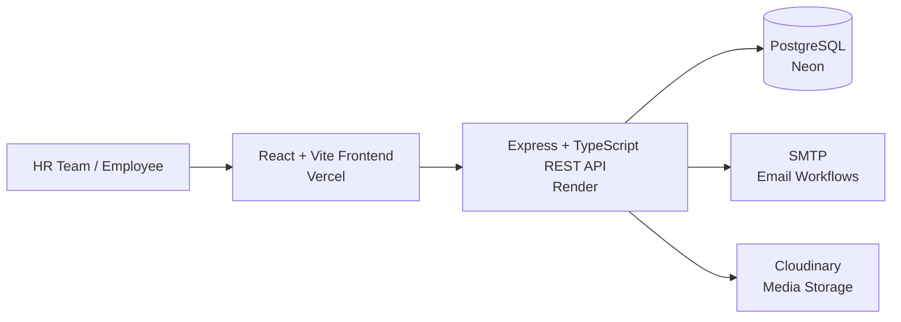
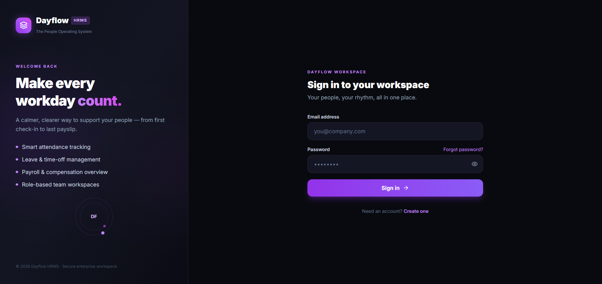

# Dayflow HRMS

> A production-ready, role-based Human Resource Management System for managing employees, attendance, leave, payroll, documents, notifications, and reports through one focused workspace.

[](https://dayflow-zeta-flame.vercel.app/login)
[](https://dayflow-api-0tbu.onrender.com/health)
[](LICENSE)

---

## 🚀 Start Here

**Dayflow HRMS** is a full-stack, role-based HR workspace designed to simplify everyday employee and HR operations.

Try the deployed application:

**[Open Dayflow HRMS](https://dayflow-zeta-flame.vercel.app/login)**

The production frontend is hosted on **Vercel**, the REST API runs on **Render**, and application data is persisted in **PostgreSQL on Neon**.

| Resource             | Link                                                                                     |
| -------------------- | ---------------------------------------------------------------------------------------- |
| 🌐 Web Application   | [dayflow-zeta-flame.vercel.app/login](https://dayflow-zeta-flame.vercel.app/login)       |
| ❤️ Backend Health    | [dayflow-api-0tbu.onrender.com/health](https://dayflow-api-0tbu.onrender.com/health)     |
| ℹ️ API Information   | [dayflow-api-0tbu.onrender.com/api/info](https://dayflow-api-0tbu.onrender.com/api/info) |
| 📚 API Documentation | [dayflow-api-0tbu.onrender.com/api/docs](https://dayflow-api-0tbu.onrender.com/api/docs) |

---

## 🎯 What Is Dayflow?

Dayflow is a centralized HRMS that brings the most important employee-management workflows into a single application.

Instead of managing employee information, attendance, leave, payroll, documents, and operational reports across separate tools, Dayflow provides a unified workspace with permissions based on the user's role.

### Core Roles

| Role                 | Responsibility                                                            |
| -------------------- | ------------------------------------------------------------------------- |
| 👑 **Administrator** | Full system-level control and organizational management                   |
| 🧑‍💼 **HR**         | Employee operations, attendance, leave, payroll, documents, and reporting |
| 👤 **Employee**      | Personal profile, attendance, leave requests, and payroll information     |

Every role receives a dedicated dashboard and access only to the operations permitted for that role.

---

## 🔄 Product Flow

```text
                 ┌───────────────────┐
                 │   Authentication  │
                 │ Sign Up / Sign In │
                 └─────────┬─────────┘
                           │
                           ▼
                 ┌───────────────────┐
                 │   Role Detection  │
                 └─────────┬─────────┘
                           │
            ┌──────────────┼──────────────┐
            ▼              ▼              ▼
       Administrator       HR         Employee
            │              │              │
            ▼              ▼              ▼
       System Control   HR Operations   Self-Service
            │              │              │
            └──────────────┼──────────────┘
                           ▼
                 ┌───────────────────┐
                 │   HRMS Operations  │
                 │                   │
                 │ Employees         │
                 │ Attendance        │
                 │ Leave             │
                 │ Payroll           │
                 │ Documents         │
                 │ Notifications     │
                 │ Reports           │
                 └───────────────────┘
```

---

# ✨ Features

## 🔐 Authentication & Authorization

* Secure account registration and sign-in
* Role-based access control
* Protected frontend routes
* Server-side authorization for business operations
* JWT-based authentication
* Short-lived access tokens
* Refresh-token rotation and revocation
* Password hashing using bcrypt
* Password recovery workflow
* Email verification workflow
* Rate limiting and security middleware

---

## 👥 Employee Management

* Employee directory
* Search and filtering
* Employee profile pages
* Personal information management
* Job and employment information
* Profile-picture uploads
* Employee document management
* Compensation records
* Salary structures
* Gross salary, allowances, deductions, and net salary

---

## ⏱️ Attendance Management

Employees can manage their daily attendance while authorized users can monitor attendance records.

* Check-in
* Check-out
* Attendance history
* Date-based filtering
* Attendance status tracking
* Employee attendance visibility
* Timesheet-oriented workflows

---

## 🏖️ Leave Management

Dayflow provides an end-to-end leave workflow.

### Employee

* Submit leave requests
* View leave history
* Track request status
* Cancel eligible requests

### HR / Authorized Roles

* Review leave requests
* Approve requests
* Reject requests
* Add reviewer comments
* Track leave activity

---

## 💰 Payroll

Payroll information is protected by role-based permissions.

* Salary structures
* Gross salary
* Allowances
* Deductions
* Net salary
* Payroll history
* Employee payroll views
* Restricted access to confidential compensation data

---

## 📄 Documents

* Employee document management
* Profile-related uploads
* Secure document access
* Cloud-based media storage through Cloudinary

---

## 🔔 Notifications

The notification system keeps users informed about important HR events.

Examples include:

* Leave request updates
* Approval and rejection events
* Account-related notifications
* Operational updates

---

## 📊 Reports & Operational Visibility

Dayflow provides role-specific visibility into important HR operations.

Available reporting areas include:

* Employee reports
* Attendance reports
* Leave reports
* Payroll reports
* Operational dashboards

The interface is designed for repeated administrative use with a responsive dark-themed workspace.

---

# 🏗️ Architecture



### Frontend

The frontend is built with React and Vite and provides:

* Role-specific dashboards
* Protected routes
* Centralized API communication
* Authentication state management
* Responsive UI
* Form validation
* Notifications
* Data visualization and reporting interfaces

### Backend

The backend follows a modular REST API architecture using:

* Express
* TypeScript
* Prisma
* PostgreSQL
* Zod
* JWT authentication
* Security middleware

The backend is responsible for authentication, authorization, business rules, validation, database access, and protected HR operations.

### Database

PostgreSQL stores application data including:

* Users
* Employees
* Roles
* Attendance
* Leave requests
* Payroll
* Documents
* Notifications
* Related HR records

Prisma provides typed database access and schema management.

---

# 🖥️ Authentication

The deployed authentication experience provides a single entry point for:

* Sign in
* Account creation
* Password visibility control
* Password recovery
* Email verification



---

# 🛠️ Technology Stack

### Frontend

* React 19
* Vite
* React Router DOM
* Tailwind CSS
* Lucide React
* Sonner

### Backend

* Node.js
* Express 5
* TypeScript
* Prisma 7
* Zod

### Database

* PostgreSQL
* Neon

### Deployment

* Vercel — Frontend
* Render — Backend
* Neon — PostgreSQL

### Security

* bcrypt
* JWT access tokens
* Refresh-token rotation
* Refresh-token revocation
* Helmet
* CORS
* Rate limiting
* Zod validation
* Server-side authorization

### Integrations

* SMTP — email workflows
* Cloudinary — profile and media storage

---

# 📁 Repository Structure

```text
dayflow-odoo-hack/
│
├── frontend/
│   ├── src/
│   │   ├── components/       # Shared UI and application components
│   │   ├── context/          # Authentication and HRMS state
│   │   ├── pages/            # Auth, dashboard, profile, payroll, reports, etc.
│   │   ├── services/         # Centralized API service layer
│   │   └── utils/            # Validation, formatting, status and export helpers
│   │
│   └── ...
│
├── backend/
│   ├── prisma/
│   │   ├── schema.prisma     # Database schema
│   │   ├── seed/              # Seed data
│   │   └── migrations/        # Database migrations
│   │
│   ├── src/
│   │   ├── modules/           # Auth and HRMS business modules
│   │   ├── middleware/        # Authentication and request protection
│   │   └── ...
│   │
│   ├── tests/                 # Integration and health tests
│   └── ...
│
├── docs/
│   └── screenshots/           # Documentation screenshots
│
├── LICENSE
└── README.md
```

---

# ⚙️ Run Locally

## Prerequisites

Make sure you have:

* **Node.js 20+**
* **PostgreSQL 14+** or a hosted PostgreSQL database
* SMTP credentials for email workflows
* Cloudinary credentials for media uploads

---

## 1. Clone the Repository

```bash
git clone https://github.com/ShreyaJ-27/dayflow-odoo-hack.git
cd dayflow-odoo-hack
```

---

## 2. Configure the Backend

```powershell
cd backend
npm install
```

Create your environment file from:

```text
backend/.env.example
```

Configure the required database, authentication, SMTP, Cloudinary, and application variables.

Then initialize Prisma:

```powershell
npm run prisma:generate
npm run prisma:migrate
npm run prisma:seed
```

Start the backend:

```powershell
npm run dev
```

The API runs on the configured `PORT`.

Health check:

```text
GET /health
```

---

## 3. Configure the Frontend

Open a second terminal:

```powershell
cd frontend
npm install
```

Configure the frontend API URL:

```env
VITE_API_BASE_URL=http://localhost:5000
```

Then start Vite:

```powershell
npm run dev
```

The frontend will normally be available at:

```text
http://localhost:5173
```

---

# 🧪 Development Commands

### Frontend

```powershell
npm run dev
npm run build
npm run lint
```

### Backend

```powershell
npm run dev
npm run build
npm test
```

### Prisma

```powershell
npm run prisma:generate
npm run prisma:migrate
npm run prisma:seed
```

---

# 🔌 API

The API exposes public infrastructure and authentication endpoints alongside protected HRMS modules.

### Public

```text
GET /health
GET /api/info
GET /api/docs
/api/auth/*
```

### Protected Modules

```text
/api/dashboard
/api/employees
/api/attendance
/api/leave
/api/payroll
/api/documents
/api/notifications
/api/reports
```

Protected requests use bearer-token authentication:

```http
Authorization: Bearer <accessToken>
```

The deployed health endpoint verifies database connectivity.

When the database is unavailable, the API responds with:

```text
HTTP 503
```

---

# 🔒 Security Model

Security is implemented across both frontend and backend layers.

### Authentication

```text
Credentials
    │
    ▼
Password Verification
    │
    ▼
JWT Access Token
    │
    ▼
Authenticated Request
    │
    ▼
Server Authorization
```

### Key protections

* Passwords are never stored in plaintext.
* Passwords are hashed using bcrypt.
* Access tokens are short-lived.
* Refresh tokens are rotated and revocable.
* Protected operations are authorized server-side.
* Request payloads are validated using Zod.
* HTTP security headers are applied using Helmet.
* CORS policies restrict cross-origin access.
* Rate limiting reduces abuse against sensitive endpoints.
* Confidential payroll data is restricted to authorized roles.

> Frontend route protection improves user experience, but backend authorization remains the source of truth for security.

---

# ☁️ Production Deployment

Dayflow uses a separated deployment architecture:

```text
                    Internet
                       │
                       ▼
              ┌─────────────────┐
              │ Vercel Frontend │
              └────────┬────────┘
                       │ HTTPS
                       ▼
              ┌─────────────────┐
              │  Render API     │
              └───────┬─────────┘
                      │
          ┌───────────┼───────────┐
          ▼           ▼           ▼
      PostgreSQL    SMTP      Cloudinary
        Neon       Email        Media
```

### Production services

* **Frontend:** Vercel
* **Backend:** Render
* **Database:** Neon PostgreSQL
* **Media:** Cloudinary
* **Email:** SMTP provider

---

# 📌 Project Status

Dayflow HRMS currently includes the core production application flow:

* [x] Authentication
* [x] Role-based access control
* [x] Administrator workspace
* [x] HR workspace
* [x] Employee workspace
* [x] Employee management
* [x] Attendance
* [x] Leave management
* [x] Payroll
* [x] Documents
* [x] Notifications
* [x] Reports
* [x] PostgreSQL persistence
* [x] Production API
* [x] Production frontend
* [x] API health monitoring

---

# 📄 License

This project is licensed under the **Apache License 2.0**.

See the [`LICENSE`](LICENSE) file for the complete license text.

---

## ⭐ Dayflow HRMS

A unified HR workspace built to make employee operations **simpler, more secure, and easier to manage**.

**Live Application:**
https://dayflow-zeta-flame.vercel.app/login

**Repository:**
https://github.com/ShreyaJ-27/dayflow-odoo-hack
